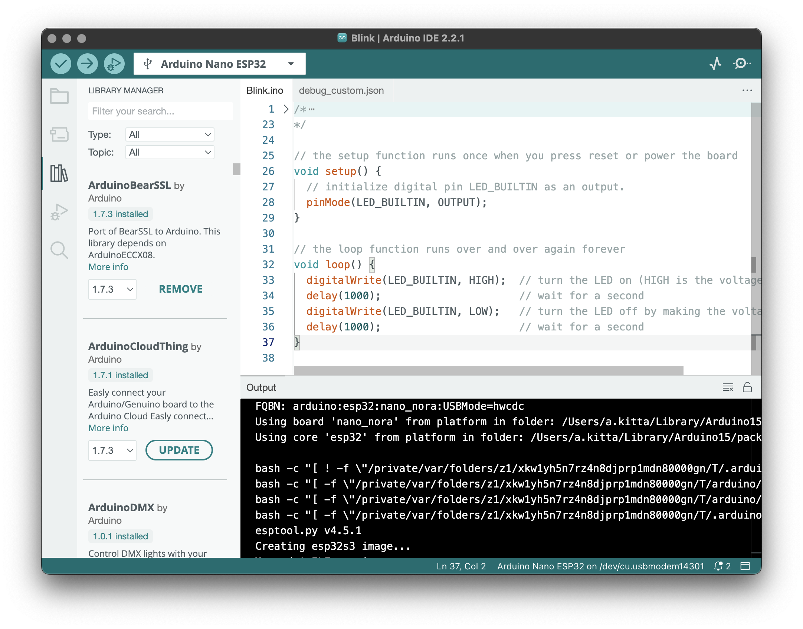

# Arduino IDE 2.x with AI Assistant Integration

This fork of Arduino IDE 2.x includes an embedded **Model Context Protocol (MCP)** server, enabling AI assistants like Claude Code to programmatically interact with the IDE. Write code, compile, upload, and debug Arduino projects through natural language conversation.

---

## AI Assistant Integration (MCP)

### Overview

The MCP extension embeds a server directly into the Arduino IDE, providing AI assistants with complete access to the Arduino development workflow. No external processes, no complex setup - the IDE itself becomes the MCP server.

```
+------------------+        HTTP/SSE         +------------------+
|   Claude Code    |<----------------------->|   Arduino IDE    |
|   (MCP Client)   |   http://127.0.0.1:3847 |   (MCP Server)   |
+------------------+                         +------------------+
                                                      |
                                             Arduino Services
                                            (Sketches, Boards,
                                             Libraries, Serial,
                                             Compiler, Config)
```

### Key Capabilities

| Category | Operations |
|----------|------------|
| **Sketch Management** | Create, open, edit, save sketches; browse and clone built-in examples |
| **Build Operations** | Compile sketches with async progress tracking; upload to boards |
| **Board Management** | Detect connected boards; select board/port; install cores; query pin capabilities |
| **Serial Monitor** | Connect, read, write, disconnect; configure baud rate and line endings |
| **Library Management** | Search Arduino library registry; install/remove libraries; browse library examples |
| **Code Formatting** | Format Arduino/C++ code using clang-format |
| **Configuration** | Manage sketchbook location, board manager URLs, IDE settings |

### Real-Time Collaboration

When the AI assistant modifies code through MCP:
- The IDE immediately opens and focuses the changed file
- A notification appears showing what was created or modified
- The editor auto-reloads content without manual refresh

This provides a seamless pair-programming experience where you see changes as the AI makes them.

### Tool Router Pattern

To minimize context window usage, the MCP server uses a router pattern by default. Instead of exposing 11+ individual tools (which would consume significant context), it exposes 4 meta-tools:

| Meta-Tool | Purpose |
|-----------|---------|
| `list_tool_categories` | List available categories (sketch, build, board, serial, library, ide) |
| `get_category_tools` | Get detailed tool definitions for a category |
| `execute_tool` | Execute any tool by name with parameters |
| `search_tools` | Search for tools by keyword |

This allows the AI to discover and use tools on-demand without loading all definitions upfront.

### Quick Start

1. **Launch Arduino IDE** - The MCP server starts automatically on `http://127.0.0.1:3847`

2. **Configure Claude Code** - Add to your MCP settings:
   ```json
   {
     "mcpServers": {
       "arduino": {
         "url": "http://127.0.0.1:3847/sse"
       }
     }
   }
   ```

3. **Restart Claude Code** and start interacting:
   - "Create a new sketch from the Blink example"
   - "What boards are connected?"
   - "Compile the current sketch and explain any errors"
   - "Upload to the Arduino Uno on /dev/ttyUSB0"

### IDE Settings

Access via **File > Preferences > Settings**, search for "MCP":

| Setting | Description | Default |
|---------|-------------|---------|
| `arduino.mcp.enabled` | Enable/disable MCP server | `true` |
| `arduino.mcp.autoConnect` | Auto-start on IDE launch | `true` |
| `arduino.mcp.port` | HTTP port for MCP server | `3847` |
| `arduino.mcp.logLevel` | Logging verbosity | `info` |
| `arduino.mcp.toolMode` | Tool exposure mode (router/direct) | `router` |

### Verify Connection

```bash
curl http://127.0.0.1:3847/health
```

Returns server status including available services.

### STEM Education Features

The extension includes enhancements for educational use:

- **Built-in Example Browser**: Access all Arduino examples with descriptions
- **Hardware Reference Data**: Query board specs, pin capabilities, PWM/I2C/SPI pins
- **Beginner-Friendly Errors**: Get compilation errors with explanations and fix suggestions

### Documentation

See [arduino-mcp-extension/README.md](arduino-mcp-extension/README.md) for complete documentation including:
- Full tool reference with all actions and parameters
- Example interactions and use cases
- Tool safety annotations
- Troubleshooting guide

---

## Arduino IDE 2.x

This repository contains the source code of the Arduino IDE 2.x. If you're looking for the old IDE, go to the [repository of the 1.x version](https://github.com/arduino/Arduino).

The Arduino IDE 2.x is a major rewrite, sharing no code with the IDE 1.x. It is based on the [Theia IDE](https://theia-ide.org/) framework and built with [Electron](https://www.electronjs.org/). The backend operations such as compilation and uploading are offloaded to an [arduino-cli](https://github.com/arduino/arduino-cli) instance running in daemon mode. This new IDE was developed with the goal of preserving the same interface and user experience of the previous major version in order to provide a frictionless upgrade.



## Download

You can download the latest release version and nightly builds from the [software download page on the Arduino website](https://www.arduino.cc/en/software).

## Building from Source

### Prerequisites

- Node.js 18 or later
- Yarn 4.x
- Git

### Build Steps

```bash
# Clone the repository
git clone https://github.com/mixelpixx/arduino-ide.git
cd arduino-ide

# Install dependencies
yarn install

# Build all packages including MCP extension
yarn build:dev

# Start the IDE
cd electron-app
yarn start
```

The MCP server will be available at `http://127.0.0.1:3847` when the IDE launches.

## Support

If you need assistance, see the [Help Center](https://support.arduino.cc/hc/en-us/categories/360002212660-Software-and-Downloads) and browse the [forum](https://forum.arduino.cc/index.php?board=150.0).

## Bugs and Issues

If you want to report an issue, you can submit it to the [issue tracker](https://github.com/mixelpixx/arduino-ide/issues) of this repository.

### Security

If you think you found a vulnerability or other security-related bug in this project, please read our [security policy](https://github.com/arduino/arduino-ide/security/policy) and report the bug to the Security Team.

e-mail contact: security@arduino.cc

## Contributions

Contributions are welcome. See the [contributor guide](docs/CONTRIBUTING.md) and [development guide](docs/development.md) for more information.

## License

The code contained in this repository and the executable distributions are licensed under the terms of the GNU AGPLv3. The executable distributions contain third-party code licensed under other compatible licenses such as GPLv2, MIT and BSD-3. If you have questions about licensing please contact us at [license@arduino.cc](mailto:license@arduino.cc).
